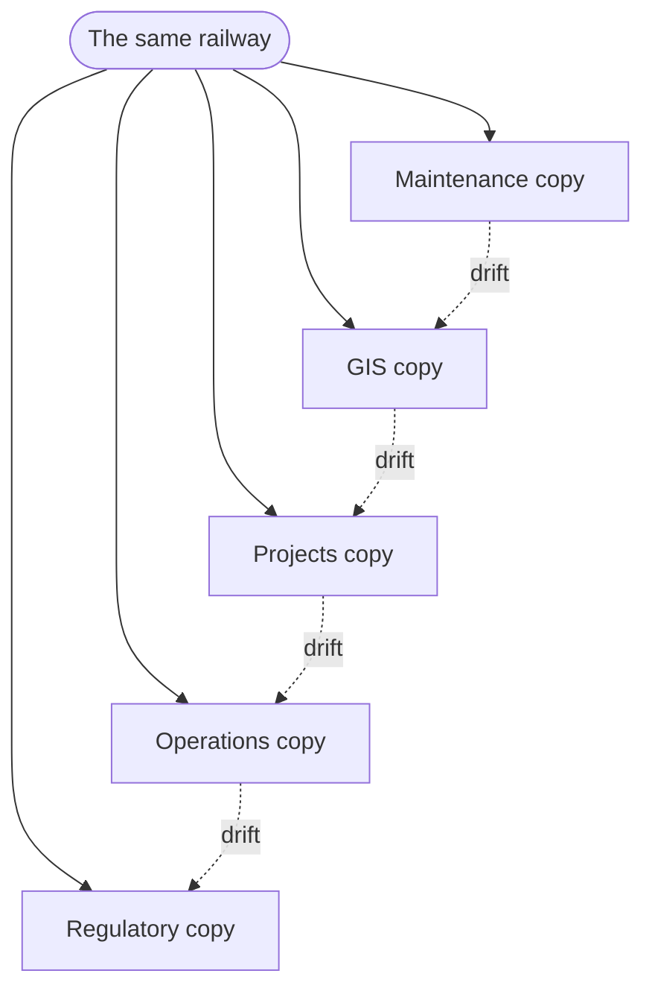
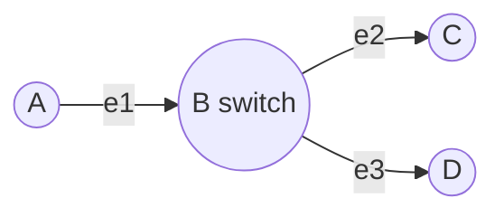
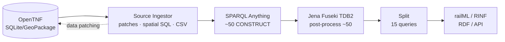
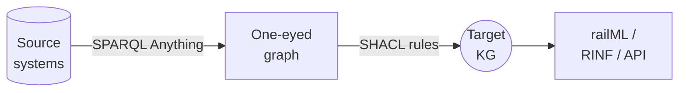

# Building the Norwegian Railway<br>Knowledge Graph

### Where the Semantic Web Stack Runs Off the Track

<div class="mt-8 opacity-90 text-lg">
Lessons from SPARQL Anything · GeoSPARQL · SHACL · RINF
</div>

<div class="abs-bl m-6 text-left text-sm opacity-90">
Mathias Vanden Auweele — <b>Matdata</b><br>
with Bane NOR · Sem4Tra 2026, Ghent
</div>

<!--
Welcome. This is a production experience report — an honest account of building
a national railway knowledge graph, and where today's Semantic Web stack helped
us and where it got in the way.
-->

---
layout: two-cols-header
---

# Who is behind this?

::left::

<div class="pr-6 text-sm">

<div style="display:flex;align-items:center;gap:0.6rem;margin-bottom:0.4rem">
  
  <span style="font-size:1.5rem;font-weight:700">Matdata</span>
</div>

A **1-person data-consultancy** specialised in semantic mapping and knowledge graphs for rail.

- Working mainly with **ERA**, **Bane NOR** and **Certifer**
- Hands-on with railML, RTM/RSM, OpenTNF and vendor topology models
- <b>Role here:</b> semantic modelling & pipeline partner

<div style="display:flex;align-items:center;gap:1.4rem;margin-top:0.6rem;opacity:0.9">
  <a href="https://www.era.europa.eu/" target="_blank" rel="noopener noreferrer" style="text-decoration:none !important; border-bottom:none !important; text-underline-offset:0 !important; text-decoration-line:none !important"></a>
  <a href="https://www.certifer.be/" target="_blank" rel="noopener noreferrer" style="text-decoration:none !important; border-bottom:none !important; text-underline-offset:0 !important; text-decoration-line:none !important"></a>
  <a href="https://infrabel.be/" target="_blank" rel="noopener noreferrer" style="text-decoration:none !important; border-bottom:none !important; text-underline-offset:0 !important; text-decoration-line:none !important"></a>
  <a href="https://www.data-treehouse.com/" target="_blank" rel="noopener noreferrer" style="text-decoration:none !important; border-bottom:none !important; text-underline-offset:0 !important; text-decoration-line:none !important"></a>
</div>
<div style="display:flex;align-items:center;gap:1.4rem;margin-top:0.6rem;opacity:0.9">
  <a href="https://kapernikov.com/" target="_blank" rel="noopener noreferrer" style="text-decoration:none !important; border-bottom:none !important; text-underline-offset:0 !important; text-decoration-line:none !important"></a>
  <a href="https://www.cognizone.com/" target="_blank" rel="noopener noreferrer" style="text-decoration:none !important; border-bottom:none !important; text-underline-offset:0 !important; text-decoration-line:none !important"></a>
  <a href="https://www.transurb.com/" target="_blank" rel="noopener noreferrer" style="text-decoration:none !important; border-bottom:none !important; text-underline-offset:0 !important; text-decoration-line:none !important"></a>
</div>

</div>

::right::

<div class="pl-6 border-l border-gray-400/40 text-sm">


Norway's **national infrastructure manager** — owns and runs the railway network.

- 5000+ km of track, signals, switches, bridges, tunnels, catenary
- Builds, maintains, renews and **plans decades ahead**
- Owner of the **Digital Infrastructure Model (DIM)** — the graph in this talk

<div class="mt-3 text-xs opacity-70">This is a Bane NOR use case; Matdata collaborates.</div>

</div>

<!--
Two organisations. Matdata brings the semantic-web know-how; Bane NOR owns the
railway, the data and the regulatory obligations. Everything you see is a real
production system, the DIM.
-->

---
layout: default
---

# Project overview — the DIM

The **Digital Infrastructure Model**: one authoritative model of the Norwegian railway, serving reference data to every use case from a single source of truth.

<div class="grid grid-cols-4 gap-4 mt-8">
  <div class="rounded-lg bg-blue-500/10 p-4 text-center">
    <div class="text-3xl font-bold text-blue-500">~13M</div>
    <div class="text-sm opacity-80 mt-1">triples in production</div>
  </div>
  <div class="rounded-lg bg-green-500/10 p-4 text-center">
    <div class="text-3xl font-bold text-green-500">17</div>
    <div class="text-sm opacity-80 mt-1">ontologies</div>
  </div>
  <div class="rounded-lg bg-amber-500/10 p-4 text-center">
    <div class="text-3xl font-bold text-amber-500">5000+</div>
    <div class="text-sm opacity-80 mt-1">km of track</div>
  </div>
  <div class="rounded-lg bg-purple-500/10 p-4 text-center">
    <div class="text-3xl font-bold text-purple-500">~40</div>
    <div class="text-sm opacity-80 mt-1">asset types mapped</div>
  </div>
</div>

<div class="mt-8 grid grid-cols-2 gap-8">

<div>

**Not a proof of concept.** Runs in production on Azure Kubernetes with Airflow orchestration.

</div>

<div>

**Outputs:** railML files, an RDF endpoint, an JSON-LD API — and a regulatory **RINF** export to the EU.

</div>

</div>

<div class="mt-6 grid grid-cols-3 gap-4 text-sm">
  <div class="rounded-lg bg-green-500/10 p-3">
    <div class="text-green-600 font-bold text-xs uppercase tracking-wide">In production today</div>
    <div class="mt-1">Run-time calculation & conflict analysis · the public <b>DIM web portal</b> serving traffic-oriented infrastructure data to the whole sector.</div>
  </div>
  <div class="rounded-lg bg-blue-500/10 p-3">
    <div class="text-blue-600 font-bold text-xs uppercase tracking-wide">Exports live</div>
    <div class="mt-1">railML <b>v3.2 / v3.3</b>, RDF, JSON-LD & CSV — one model, many consumer-ready formats.</div>
  </div>
  <div class="rounded-lg bg-amber-500/10 p-3">
    <div class="text-amber-600 font-bold text-xs uppercase tracking-wide">Coming fall 2026</div>
    <div class="mt-1">RINF & Network Statement infrastructure — regulatory reporting straight from the graph.</div>
  </div>
</div>

<!--
This is the scale. The point of DIM is consolidation: dozens of systems, one
connected model that every user group can consume. It already serves live use
cases — run-time calculation, the DIM portal, and multiple export formats — with
regulatory RINF reporting landing in fall 2026.
-->

---
layout: default
---

# The problem

A national railway exists **simultaneously in a dozen systems** — and they all disagree about the same track.

<div class="grid grid-cols-2 gap-8 mt-6">

<div>

Historically, every use case grew **its own application, its own data model, its own copy** of the railway:

- Asset maintenance (track, signalling, catenary…)
- Infrastructure projects (ERTMS, renewals)
- Operations (capacity, timetabling, simulation)
- Regulatory reporting
- Finance, contracts, procurement

</div>

<div>



</div>

</div>

<div class="mt-2 text-lg">
Changes in one system never reach the others. Reconciliation is <b>manual and error-prone</b>.
</div>

<!--
The "same" railway looks different everywhere. Sometimes so divergent they look
like different railways entirely. This is how most critical rail infrastructure
is actually run today.
-->

---
layout: statement
---

# The opportunity

## A knowledge graph as a **semantic integration layer**

<div class="mt-6 text-xl opacity-90 max-w-3xl mx-auto">
One authoritative model that serves reference data to every use case
from a <b>single source of truth</b> — and grounds data exchange in solid, shared reference data.
</div>

<!--
The vision behind DIM. Instead of dozens of drifting copies, one model that
feeds them all.
-->

---
layout: default
---

# The fundamental challenges

Railway asset data has **three generic, often-neglected complexities**:

<div class="grid grid-cols-3 gap-4 mt-6">
  <div class="rounded-lg border border-blue-500/40 p-4">
    <div class="text-xl font-bold text-blue-500">Location</div>
    <div class="text-sm mt-2 opacity-90">Topological · geographic · linear · address-based — four complementary dimensions at once.</div>
  </div>
  <div class="rounded-lg border border-gray-400/40 p-4 opacity-60">
    <div class="text-xl font-bold">Time</div>
    <div class="text-sm mt-2">Time of <i>knowledge</i> vs time of <i>validity</i>.</div>
  </div>
  <div class="rounded-lg border border-gray-400/40 p-4 opacity-60">
    <div class="text-xl font-bold">Identity</div>
    <div class="text-sm mt-2">Entity · lifecycle phase · aspect (equipment vs function).</div>
  </div>
</div>

<div class="mt-8 p-4 rounded-lg bg-amber-500/10">
<b>Scope of this talk:</b> we deliberately focus on <b>Location</b> — and within it, the
<b>topological</b> and <b>spatial</b> dimensions. Time and identity are equally hard, but out of scope.
</div>

<div class="mt-4 text-base opacity-80">
Why hard? These dimensions are only <b>partially supported</b> by current Semantic Web standards.
</div>

<!--
A knowledge graph is well suited to all three because it can attach independent
metadata to each property. But to keep this tractable, we deliberately narrow to
location — and even that turns out to be hard.
-->

---
layout: two-cols-header
---

# Topology vs. spatial — the core insight

::left::

<div class="pr-6">

### Geometry-first 🗺️

Most GIS / graph work: **points, lines, polygons** in a coordinate system.

- "Where is this asset?"
- latitude / longitude
- cadastral, utility, generic GIS

<div class="mt-4 text-sm opacity-70">
GeoSPARQL is built for exactly this. But still misses some key functions such as ST_X and linear referencing.
</div>

</div>

::right::

<div class="pl-6 border-l border-gray-400/40">

### Topology-first 🔗

Railways: meaning comes from **where an asset sits in the network graph** and how it affects routing.

- "How does this connect?"
- nodes, edges, navigability
- routing, reachability

<div class="mt-4 text-sm opacity-70">
No standards exists to describe the semantics for this.
</div>

</div>

::bottom::

<!--
This is the thesis of the whole talk. Ask which one your domain actually is.
Railways are topology-first — and that mismatch is where the stack runs off the
track.
-->

---
layout: default
hide: true
---

# Why geometry lies

<div class="grid grid-cols-2 gap-8 items-center">

<div>

A signal can physically stand **closer to the wrong track** than to the track it actually governs.

A purely geometric *"nearest track"* assignment attaches it to the **wrong edge**.

<div class="mt-4 p-3 rounded-lg bg-red-500/10 text-base">
Only an explicit <b>topological position</b> captures the intended meaning.
</div>

</div>

<div>



<div class="text-sm opacity-80 mt-3">
Node B is a switch. Navigability: <code>e1→e2</code>, <code>e1→e3</code>.<br>
A signal "at 0.4 on edge e1" is unambiguous — regardless of absolute geometry.
</div>

</div>

</div>

<div class="mt-6 grid grid-cols-3 gap-3 text-sm">
  <div class="rounded bg-green-500/10 p-3"><b>Unambiguous positioning</b><br>precise, unique location</div>
  <div class="rounded bg-green-500/10 p-3"><b>Clear navigability</b><br>traverse for routes & reachability</div>
  <div class="rounded bg-green-500/10 p-3"><b>Things, not strings</b><br>not names or km-posts</div>
</div>

<!--
The signal example is the one everyone remembers. Geometry alone gets it wrong;
the topology gets it right. These three properties are what plain geometry
cannot give you.
-->

---
layout: default
---

# Many topology models coexist

There is **no single** railway topology model — several are in active use, often within one organisation.

<div class="grid grid-cols-2 gap-x-8 gap-y-2 mt-4 text-sm">

<div>

- **RailTopoModel (RTM)** — UIC IRS 30100, the topology-first foundation (micro/meso/macro)
- **railML 3.x** — XML serialisation, adopted RTM for positioning
- **RSM** — UIC's own continuation of RTM
- **ERA ontology** — the EU regulatory model behind RINF

</div>

<div>

- **OpenTNF** — open format on GeoPackage/SQLite
- **Proprietary** — Hacon TPS, TrafIT railOscope, Infrabel InfraNET…
- **OpenStreetMap** — partial, inconsistent topology

</div>

</div>

<div class="mt-5 p-4 rounded-lg bg-blue-500/10">
Each draws the network boundary differently, picks a different granularity, uses different IDs.<br>
<b>Integration is fundamentally mapping every base topology onto one unified topology.</b>
</div>

<div class="mt-3 text-sm opacity-70">
Not every model is disciplined: some don't express navigability; some attach signals directly into the topology graph (which breaks maintenance).
</div>

<!--
This fragmentation is itself part of the problem. Our whole job is to map these
onto one shared topology. RTM is a good integration target because navigability
is explicit.
-->

---
layout: default
hide: true
---

# Asset positioning — three methods

<div class="grid grid-cols-3 gap-4 mt-4">

<div class="rounded-lg border border-green-500/50 p-4">
<div class="font-bold text-green-500">① Intrinsic coordinates</div>
<div class="text-sm mt-2 opacity-90">
Bound to a net element, position <b>0–1</b> along an edge.<br>
"Signal at 0.4 on edge e1."
</div>
<div class="text-xs mt-2 opacity-70">The only method intrinsically tied to topology — most important.</div>
</div>

<div class="rounded-lg border border-gray-400/40 p-4">
<div class="font-bold">② Geometric coordinates</div>
<div class="text-sm mt-2 opacity-90">
Ordinary spatial coords, but used as a <i>reference</i> to the topological position.
</div>
<div class="text-xs mt-2 opacity-70">Makes visualisation easy while staying meaningful.</div>
</div>

<div class="rounded-lg border border-gray-400/40 p-4">
<div class="font-bold">③ Linear coordinates</div>
<div class="text-sm mt-2 opacity-90">
A measure along a linear positioning system (LPS). The LPS is defined as a linear event on the topology.
</div>
<div class="text-xs mt-2 opacity-70">Distance calculations along one axis.</div>
</div>

</div>

<div class="mt-6 p-4 rounded-lg bg-red-500/10">
⚠️ <b>Kilometrage ("km + offset")</b> looks like linear referencing but resets at boundaries,
has gaps & overlaps, and changes on re-survey. Treat it as an <b>address</b>, not a measure to compute with.
</div>

<!--
Three ways assets sit on the topology. Intrinsic coordinates are the star.
Kilometrage is the trap — everyone assumes it's a clean measure; it isn't.
-->

---
layout: statement
---

# Choosing the base ontology

<div class="text-xl opacity-90 max-w-3xl mx-auto mt-4">
In data modelling, the model always tries to <b>fit the use case</b>.
</div>

<div class="mt-8 max-w-3xl mx-auto text-left text-lg leading-relaxed">
Data on one side, a list of use cases on the other. You must pick a model that
<b>fits</b> — and the one that covers the <b>most proven use cases wins</b>.
</div>

<!--
This is the general data-modelling principle I want people to take away. Don't
pick the trendy or mandated model — pick the one whose proven use-case coverage
matches your data and your needs.
-->

---
layout: default
---

# railML 3.x vs. ERA ontology

Two **asset-describing** candidates for the internal backbone (comparing within one family).

<div class="grid grid-cols-2 gap-6 mt-2 text-sm">

<div>

| Requirement | railML | ERA |
|---|:--:|:--:|
| Native ontology | ○ | ● |
| Open / community-governed | ◕ | ● |
| RINF compatibility | ◑ | ● |
| Widely used exchange format | ● | ◑ |
| Proven industrial adoption | ● | ◑ |
| Detailed asset catalogue | ◕ | ◔ |

</div>

<div>

| Requirement | railML | ERA |
|---|:--:|:--:|
| Topology management | ◔ | ○ |
| Schematic track plan | ◕ | ◔ |
| Route time calculation | ◕ | ○ |
| Timetable management | ◕ | ○ |
| ETCS data exchange | ◕ | ○ |
| Network statement | ◕ | ◑ |

</div>

</div>

<div class="mt-4 grid grid-cols-2 gap-6 text-sm">
<div class="p-3 rounded-lg bg-green-500/10">
<b>Winner: railML 3.x</b> as the internal backbone — proven use-case coverage, RTM topology foundation.
</div>
<div class="p-3 rounded-lg bg-blue-500/10">
<b>ERA</b> is native RDF & RINF-mandated → we keep it as an <b>export target</b>, not the backbone.
</div>
</div>

<div class="mt-2 text-xs opacity-60">● full &nbsp; ◕ good &nbsp; ◑ partial &nbsp; ◔ limited &nbsp; ○ none. Generic aspects reuse OWL-Time, QUDT, SKOS, GeoSPARQL, PROV.</div>

<!--
ERA wins on being native RDF and regulatory. On almost every other axis railML
is more complete today. So railML is the backbone; ERA is where we export. This
is the principle from the previous slide applied.
-->

---
layout: section
---

# The implementation

How we build the graph in production

<!--
Now the pipeline. I'll show the vision, the reality, and how the transformation
layer evolved.
-->

---
layout: default
---

# The pipeline — vision vs. reality

<div class="text-base opacity-80 mb-2">
Vision: <b>sources → one graph → railML out</b>. Reality needed considerably more machinery.
</div>



<div class="grid grid-cols-3 gap-4 mt-6 text-sm">
  <div class="rounded bg-yellow-500/10 p-3"><b>Source Ingestor</b><br>exports SQL tables → CSV, does spatial pre-compute in SpatiaLite where GeoSPARQL is lacking</div>
  <div class="rounded bg-blue-500/10 p-3"><b>Staging + hot-swap</b><br>post-processing on a staging dataset; swap behind endpoint only when clean</div>
  <div class="rounded bg-green-500/10 p-3"><b>Outputs</b><br>Splitted KG because rdflib limitations; railML bridges existing tools; RDF & RINF for the future</div>
</div>

<!--
The vision was three boxes. Reality has an ingestor, staging datasets,
hot-swaps, and dozens of queries. The hot-swap means consumers never see a
half-built graph.
-->

---
layout: two-cols-header
---

# Ingestion: SPARQL Anything

::left::

<div class="pr-4">

**Why?** We already had to learn SPARQL for querying — so **why learn a second mapping language** (R2RML, RML)?

SPARQL Anything + **Facade-X** lets us `CONSTRUCT` RDF from XML/CSV/GeoPackage with **one language** for mapping *and* querying.

- One `CONSTRUCT` per asset CSV
- ~40 asset types covered
- Low entry barrier for an RDF-new team

</div>

::right::

```sparql {all}{maxHeight:'320px'}
CONSTRUCT {
  ?balise a railml3:Balise, rtm:NetEntity ;
    rdfs:label ?label ;
    rtm:hasSpotLocation ?loc .
  ?loc a rtm:SpotLocation ;
    rtm:onNetElement ?netelement ;
    rtm:hasIntrinsicCoordinate ?coord .
}
WHERE {
  SERVICE <x-sparql-anything:location=
      balises.csv,csv.headers=true> {
    ?s xyz:atb_banedata_id ?id ;
       xyz:name ?label ;
       xyz:measure_on_link ?coord .
  }
  BIND(IRI(CONCAT(STR(bnd:),
      "_balise_", STR(?id))) AS ?balise)
}
```

<!--
The decisive factor was language economy. Facade-X gives a uniform lens over
messy formats. This pattern repeats ~40 times, positioning each asset by
intrinsic coordinate.
-->

---
layout: default
---

# Where should transformation live?

The most instructive lesson is **not the mapping queries — it's their evolution**.

<div class="grid grid-cols-3 gap-4 mt-6">

<div class="rounded-lg border border-gray-400/40 p-4">
<div class="text-sm opacity-60">Step 1</div>
<div class="font-bold mt-1">CONSTRUCT at ingestion</div>
<div class="text-sm mt-2 opacity-90">Great for single-file, asset-by-asset mapping. Breaks when relationships span files.</div>
</div>

<div class="rounded-lg border border-amber-500/50 p-4">
<div class="text-sm opacity-60">Step 2 (today)</div>
<div class="font-bold mt-1">~50 post-processing queries</div>
<div class="text-sm mt-2 opacity-90">Cross-file logic over the assembled graph. But ordered only by filename prefix…</div>
<div class="text-xs mt-2 text-red-500">= an imperative program in SPARQL</div>
</div>

<div class="rounded-lg border border-green-500/50 p-4">
<div class="text-sm opacity-60">Step 3 (target)</div>
<div class="font-bold mt-1">Declarative SHACL rules</div>
<div class="text-sm mt-2 opacity-90">Separation of concerns · maintainability · lineage · validation + transformation together. Rule execution order is <b>computed by the engine</b> (dependency graph → fixpoint), not hand-coded by filename.</div>
</div>

</div>

<div class="mt-6 text-base">
There's a fine line between transformation and inference...
</div>

<!--
This arc — CONSTRUCT, then a pile of ordered UPDATEs, then SHACL — is the story.
The 50 post-processing queries are really an imperative program with no explicit
dependencies, no validation, no lineage. SHACL fixes all three.
-->

---
layout: two-cols-header
---

# The future

::left::

<div class="pr-4">

### Target architecture



Faithful ingestion → **declarative SHACL mapping with lineage**. Spatial pre-processing and ad-hoc queries **disappear** once the gaps close.

</div>

::right::

<div class="pl-4 border-l border-gray-400/40">

### Wish list for the community

- **Linear referencing in GeoSPARQL**, properly implemented in a triple store
- **Topology-aware functions** — routing, traversal, subnet extraction as first-class
- **Mature SHACL tooling** — lineage & impact analysis
- A **shared industry topology** — kills a whole class of conversions

</div>

::bottom::

<div class="mt-3 text-sm opacity-80">
The DIM portal is a lighthouse: infrastructure consumed directly from the triple store, and a real micro-level RINF submission — <b>today</b>.
</div>

<!--
Close the gaps and the split-paradigm pipeline collapses into this clean
picture. The wish list is concrete and evidence-backed.
-->

---
layout: two-cols-header
---

# RINF publication — compliance as a *view*

::left::

<div class="pr-4">

The EU **Register of Infrastructure**: every infrastructure manager must report a defined set of properties for interoperability.

We generate RINF **directly from the graph** via **SHACL-AF rules**, validated against ERA's official shapes.

- No parallel dataset → **no drift**
- Rules are triples → **self-documenting lineage**
- Inferred ERA triples flow **back** into DIM → enrichment for everyone

</div>

::right::

```sparql {all}{maxHeight:'300px'}
bnd:_rule_mint_primary_location
  a sh:SPARQLRule ;
  sh:construct """
    CONSTRUCT {
      ?pl a era:PrimaryLocation ;
        era:primaryLocationCode ?plc ;
        era:primaryLocationName ?label .
    }
    WHERE {
      $this rdfs:label ?label ;
        railml3:hasDesignator ?d .
      ?d railml3:hasEntry ?plc ;
         railml3:hasRegister "PLC" .
      BIND(IRI(CONCAT(STR(bnd:),
        "_primaryLocation_", ?plc)) AS ?pl)
    }
  """ .
```

::bottom::

<div class="mt-3 p-3 rounded-lg bg-green-500/10 text-sm">
🏆 Enabled the <b>first-ever RINF submission at the micro (topology) level of detail</b> — possible <i>because</i> the graph is topology-based.
</div>

<!--
Regulatory reporting becomes a view of the model, not a separate copy. And this
is where the topology foundation pays off directly: the first micro-level RINF
submission in Europe.
-->

---
layout: default
---

# What went wrong: GeoSPARQL

<div class="text-base opacity-80 mb-3">
We adopted GeoSPARQL expecting to do spatial work <b>inside</b> SPARQL. A large share had to stay in <b>SpatiaLite SQL</b>.
</div>

<div class="grid grid-cols-2 gap-8">

<div>

**GeoSPARQL is great at geometry** ✅
- WKT/GML geometries
- spatial predicates (`sfIntersects`, `sfWithin`)
- coordinate reference systems

**But railways need** ❌ *(no native support)*
- linear referencing
- routing
- topology traversal · subnet extraction

</div>

<div>

<div class="p-3 rounded-lg bg-red-500/10 text-sm">
Most striking: <b>no <code>ST_X</code> / <code>ST_Y</code> / <code>ST_Z</code></b>.
Getting a raw ordinate — a one-liner in any spatial SQL — forces a detour or an ugly regex.
</div>

```sql {all}{maxHeight:'150px'}
SELECT node_oid,
  ST_Azimuth(
    ST_StartPoint(seg),
    ST_EndPoint(seg)) AS bearing
FROM (
  SELECT Line_Substring(centreline_geom, 0,
    MIN(20/ST_Length(centreline_geom),1)) AS seg,
    node_oid
  FROM track_segments );
```

</div>

</div>

<div class="mt-3 text-sm">
<b>Consequence:</b> the transformation is split across two paradigms; spatial logic runs in SQL <i>before</i> semantic mapping.
</div>

<!--
This is the section I most want the community to hear. The gap isn't in RDF or
SPARQL expressiveness — it's the absence of standardised, well-implemented
linear-referencing and topology functions in the geospatial layer.
-->

---
layout: default
---

# Implementation & performance

Runs on **Azure Kubernetes** · **Apache Airflow 3.2** · Jena 5.6 · single Celery worker (1–4 vCPU, 28–32 GiB).

<div class="grid grid-cols-2 gap-8 mt-3">

<div class="text-xs leading-tight">

| Pipeline stage | Time |
|---|--:|
| Source ingestion (SpatiaLite → CSV) | 3.5 min |
| SPARQL Anything mapping (~50) | 10 min |
| Post-processing (~50 UPDATE) | 45 min |
| **Splitting (15 sequential)** | **1 h 30** |
| railML generation | 15 min |
| **RINF — maplib SHACL** | **10 min** |
| RINF — TopBraid SHACL | 2 h |

</div>

<div class="flex flex-col justify-center gap-4">

<div class="p-4 rounded-lg bg-amber-500/10 text-sm">
<b>Splitting + post-processing dominate</b> — both pure SPARQL over the whole graph. The 15 splitting queries are exactly the missing <b>topology traversal</b>.
</div>

<div class="p-4 rounded-lg bg-purple-500/10 text-sm">
<b>SHACL engine choice = order of magnitude.</b><br>
maplib ~10 min vs TopBraid ~2 h on the <i>same</i> rules. 
</div>

</div>

</div>

<div class="mt-3 text-xs opacity-60">Staging + hot-swap → consumers never see a partial graph.</div>

<!--
Hard numbers, because reviewers asked. Two headlines: topology traversal is the
bottleneck, and the SHACL engine you pick changes runtime by 10x.
-->

---
layout: default
---

# Implementation lessons learned

<div class="grid grid-cols-3 gap-4 mt-4 text-sm">

<div class="rounded-lg border-t-4 border-blue-500 bg-blue-500/5 p-4">
<div class="font-bold text-blue-500">SPARQL Anything</div>
<div class="mt-2"><b>+</b> one language, low barrier, uniform Facade-X lens</div>
<div class="mt-1"><b>–</b> files not DBs; cross-file logic awkward; large surface becomes imperative</div>
</div>

<div class="rounded-lg border-t-4 border-green-500 bg-green-500/5 p-4">
<div class="font-bold text-green-500">SHACL</div>
<div class="mt-2"><b>+</b> declarative, validation + transformation together, natural lineage</div>
<div class="mt-1"><b>–</b> tooling maturity; missing first-class lineage & impact analysis</div>
</div>

<div class="rounded-lg border-t-4 border-red-500 bg-red-500/5 p-4">
<div class="font-bold text-red-500">GeoSPARQL</div>
<div class="mt-2"><b>+</b> geometry, predicates, CRS handling</div>
<div class="mt-1"><b>–</b> no linear referencing, routing or topology → logic escapes to SQL or Python</div>
</div>

</div>

<div class="mt-8 p-4 rounded-lg bg-gray-500/10 text-lg text-center">
The stack is <b>geometry-centric</b>; the railway domain is <b>topology- and linear-reference-centric</b>.<br>
<span class="text-base opacity-80">That mismatch is the crux — and it generalises to any network-shaped domain.</span>
</div>

<!--
Per-technology verdict. The one-line summary is the box at the bottom: a
geometry-centric stack meeting a topology-centric domain.
-->

---
layout: center
class: text-center
---

# Takeaways

<div class="mt-6 max-w-3xl mx-auto text-left text-lg leading-relaxed space-y-3">

<div>🔗 Ask whether your domain is <b>topology-first or geometry-first</b> — it changes everything.</div>
<div>🧩 Pick the base model with the <b>most proven use-case coverage</b> for your data.</div>
<div>🛠️ A <b>battle-tested pipeline</b>: SPARQL Anything → graph → SHACL → regulated exports.</div>
<div>🧭 Know where the stack <b>shines and where it runs off the track</b> — plan around the gaps.</div>

</div>

<!--
Four things to walk away with. These apply to any network-shaped domain —
utilities, telecoms, logistics, road and pipeline networks.
-->

---
layout: end
class: text-center
---

# Thank you

### Building the Norwegian Railway Knowledge Graph

<div class="mt-6 opacity-80">
Mathias Vanden Auweele — <b>Matdata</b> · with Bane NOR<br>
Sem4Tra 2026 · Ghent
</div>

<div class="mt-8 text-sm opacity-70">
mathias@matdata.eu · matdata.eu · dim.apps.banenor.no
</div>

<div class="mt-6 flex justify-center gap-8">
  <div class="text-center">
    <a href="https://github.com/Matdata-eu/paper-sem4tra2026" target="_blank" rel="noopener noreferrer">
      
    </a>
    <div class="mt-2 text-xs opacity-80">GitHub repo</div>
  </div>
  <div class="text-center">
    <a href="https://dim.apps.banenor.no/" target="_blank" rel="noopener noreferrer">
      
    </a>
    <div class="mt-2 text-xs opacity-80">DIM portal</div>
  </div>
</div>

<div class="mt-6 text-lg">Questions?</div>

<!--
Thank you. Happy to take questions — especially on the GeoSPARQL gaps and how
they generalise beyond rail.
-->
